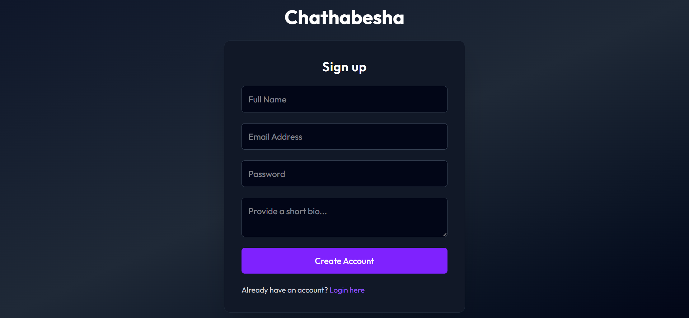
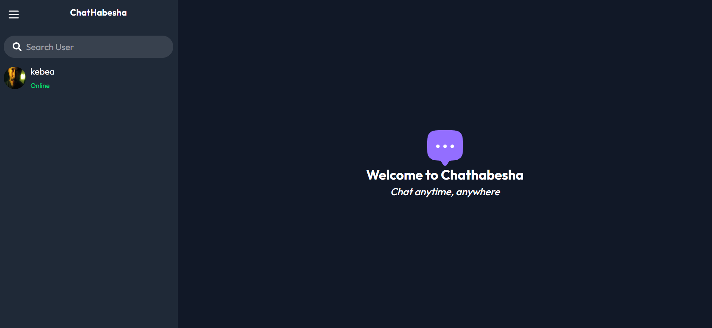
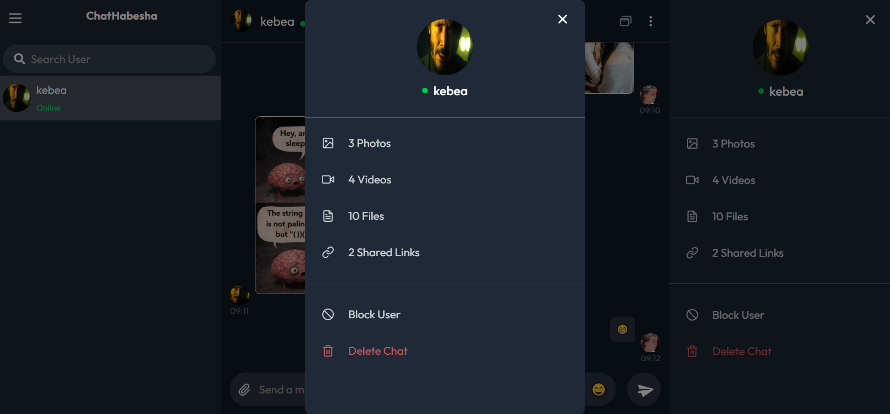
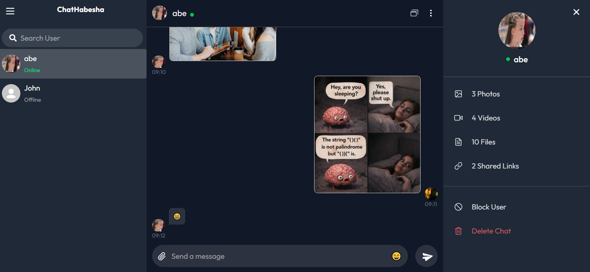
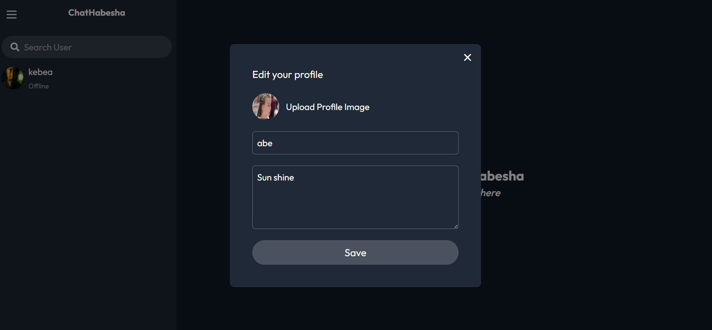
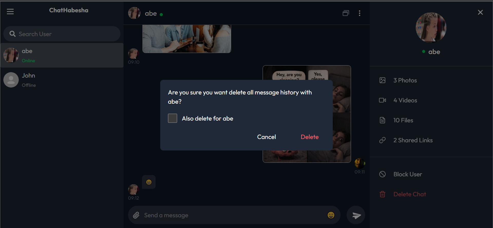

# ChatHabesha - MERN Real-Time Chat Application

<table>
  <tr>
    <td></td>
    <td></td>
    <td></td>
  </tr>
  <tr>
    <td></td>
    <td></td>
    <td></td>
  </tr>
</table>

A fully functional one-to-one real-time chat application built using the MERN stack and Socket.io for instant communication.

This application supports text and image messaging, along with user and chat management features such as blocking, clearing chats, deleting conversations, and profile updates.

## Overview

This project is a real-time browser-based chat system that enables private communication between users. It focuses on simplicity, performance, and essential chat features without unnecessary complexity.

---

## Features

### Authentication & User

- User registration and login
- Secure password hashing
- Profile updates (including avatar upload)

### Messaging

- Real-time one-to-one chat
- Send and receive text messages instantly
- Image sharing support
- Persistent message storage

### Chat Management

- Clear messages within a conversation
- Delete chat history entirely
- Delete specific contacts from chat list

### User Control

- Block user
- Unblock user

---

## Tech Stack

### Frontend

- React
- Axios
- Socket.io-client
- Tailwind CSS
- React Toastify

### Backend

- Node.js
- Express.js

### Real-time

- Socket.IO

### Security

- JSON Web Tokens (JWT)
- bcrypt

### Database

- MongoDB + Mongoose

### File Storage

- Cloudinary

---

## Environment Variables

Rename the `.env.example` file to `.env` in the server directory and configure the following variables:

```bash
MONGODB_URL="your_mongodb_url_here"
PORT=5000

JWT_SECRET="your_jwt_secret_here"

CLOUDINARY_CLOUD_NAME="your_cloudinary_name"
CLOUDINARY_API_KEY="your_cloudinary_api_key"
CLOUDINARY_API_SECRET="your_cloudinary_api_secret"
```

---

## Installation

1. Install Backend Dependencies

```bash
cd server
npm install
```

2. Install Frontend Dependencies

```bash
cd client
npm install
```

3. Start Backend Server

```bash
cd server
npm run server
```

4. Start Frontend

```bash
cd client
npm run dev
```

---

## Usage

After starting the application, visit http://localhost:5173 in your browser.
